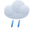

# PrévizIO Weather Icons

Jeu d'icônes météo **SVG en couleurs**, calé sur les [codes WMO 4677](https://www.nodc.noaa.gov/archive/arc0021/0002199/1.1/data/0-data/HTML/WMO-CODE/WMO4677.HTM) utilisés par la plupart des API météo (Open-Meteo, Météo-France, etc.). Chaque condition dispose d'une variante **jour** et, quand c'est pertinent, d'une variante **nuit**.

Rendu réaliste : dégradés sur le soleil, la lune et les nuages, gouttes et flocons dessinés, éclairs et grêlons. Aucune dépendance, SVG pur.

## Aperçu

| Catégorie | Codes WMO |
|-----------|-----------|
| Ciel dégagé / nuageux | 0, 1, 2, 3 |
| Brouillard | 45, 48 |
| Bruine | 51, 53, 55, 56, 57 |
| Pluie | 61, 63, 65, 66, 67 |
| Neige | 71, 73, 75, 77 |
| Averses (pluie) | 80, 81, 82 |
| Averses (neige) | 85, 86 |
| Orage | 95, 96, 99 |

Les codes **0, 1, 2, 3, 45, 48, 80, 85** ont une variante nuit dédiée (lune + étoiles, nuages assombris). Pour les autres, l'icône de nuit est identique à celle de jour — la couche nuageuse masquant toute distinction visuelle, comme le font Open-Meteo et Météo-France.

## Structure

```
icons/
  00-day.svg   00-night.svg
  01-day.svg   01-night.svg
  ...
  61-day.svg   (pas de variante nuit -> index.json pointe vers le SVG jour)
  ...
index.json     # mapping code WMO -> { label, category, day, night, hasNightVariant }
previzio-icons.js   # helper ESM : iconPath(code, "day"|"night")
```

## Utilisation

### En HTML simple

```html

```

### Via le helper JS (ESM)

```js
import { iconPath, iconPathAuto } from "./previzio-icons.js";

iconPath(95, "night");      // "icons/95-day.svg" (orage : jour = nuit)
iconPath(0, "night");       // "icons/00-night.svg"
iconPathAuto(2, false);     // variante nuit si isDay = false
```

### Avec l'API Open-Meteo

L'API renvoie un champ `weather_code` (code WMO) et un flag `is_day` :

```js
const { weather_code, is_day } = current;
const src = iconPathAuto(weather_code, is_day === 1);
document.querySelector("#weather-icon").src = src;
```

## Personnalisation

Les couleurs sont définies dans les `<defs>` de chaque SVG (dégradés `sun`, `moon`, `cloud*`, `rainDrop`...). Modifiez-les directement, ou éditez `build_icons.py` puis régénérez :

```bash
python3 build_icons.py
```

## Licence

[MIT](LICENSE) — libre d'utilisation, y compris commerciale.
